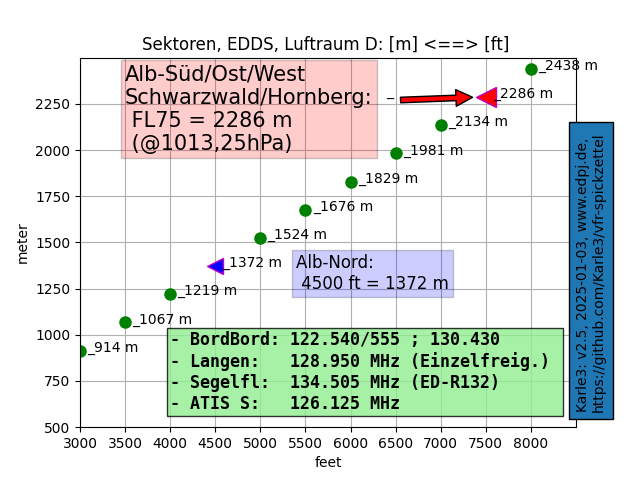

# vfr-spickzettel
A cheat sheet for glider pilots flying near Stuttgart airport ([EDDS](https://en.wikipedia.org/wiki/Stuttgart_Airport)), considering glider sectors.

## Links

For details refer to [Arbeitskreis Sektoren](https://www.bwlv.de/verband-service/ak-sektoren).

## Dependencies

* [Python](https://www.python.org/) > 3.6
* packages:
  * [numpy](https://numpy.org/), see [w3schools.com](https://www.w3schools.com/python/numpy/default.asp)
  * [matplotlib](https://matplotlib.org), see [w3schools.com](https://www.w3schools.com/python/matplotlib_intro.asp)

## Run Script

Running `vfr_spickzettel_plot.py` will create diagrams as 'vfr-spickzettel' in PNG, PDF, and SVG-format.

## Example

