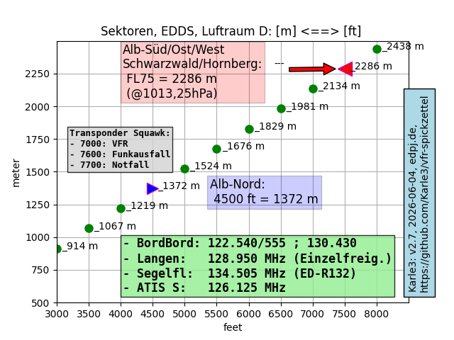

# vfr-spickzettel
A cheat sheet for glider pilots [flying](https://en.wikipedia.org/wiki/Visual_flight_rules) near Stuttgart airport ([EDDS](https://en.wikipedia.org/wiki/Stuttgart_Airport)), considering glider sectors.

## Links

For details refer to [Arbeitskreis Sektoren](https://www.bwlv.de/verband-service/ak-sektoren).

## Dependencies

* [Python](https://www.python.org/) >= 3.13.x
* packages:
  * [numpy](https://numpy.org/), numpy-2.4.6,  see [w3schools.com](https://www.w3schools.com/python/numpy/default.asp)
  * [matplotlib](https://matplotlib.org), matplotlib-3.10.9 and related packages, see [w3schools.com](https://www.w3schools.com/python/matplotlib_intro.asp)

## Run Script

Running `vfr_spickzettel_plot.py` will create diagrams as 'vfr-spickzettel' in PNG, PDF, and SVG-format.

## Example

## VENV

On running in a [virtual environment](https://docs.python.org/3/library/venv.html), see these steps:

* `python -m venv .venv`
* `.venv\Scripts\activate`
* recommended: `py -m pip install --upgrade pip`

`pip freeze` will detect no dependencies, so get Packages.
* `pip install numpy`
* `pip install matplotlib`

Then `pip freeze > requirements.txt` will create an appropriate dependency-file.

In your (virtual) environment, just get all of them by `pip install -r requirements.txt` !

### WebLinks

* [python:venv](https://docs.python.org/3/library/venv.html)
* [python:installing-using-pip-and-virtual-environments](https://packaging.python.org/en/latest/guides/installing-using-pip-and-virtual-environments/)

## Development

While development additional packages are recommended,
therefore apply `pip install -r requirements-dev.txt` to achive **pylint**.
Note, some warning had been justified in the code, no `.pylintrc` is used yet.

### pyLint

See also [project page](https://pylint.org/) and  [tutorial](https://pylint.readthedocs.io/en/stable/tutorial.html).

Just run in your (virtual) environment:

    pylint vfr_spickzettel_plot.py

and expect no warnings like

    Your code has been rated at 10.00/10 (previous run: 10.00/10, +0.00)

## Workflow

After tagging on CLI, a release is created out of the related
[TAG](https://github.com/Karle3/vfr-spickzettel/tags)
at
[GitHub:Actions:workflows](https://github.com/Karle3/vfr-spickzettel/actions/workflows/pages/pages-build-deployment).

The result is [automatically](https://github.com/Karle3/vfr-spickzettel/deployments/github-pages) deploid to [GH-pages](https://karle3.github.io/vfr-spickzettel/).

---eof